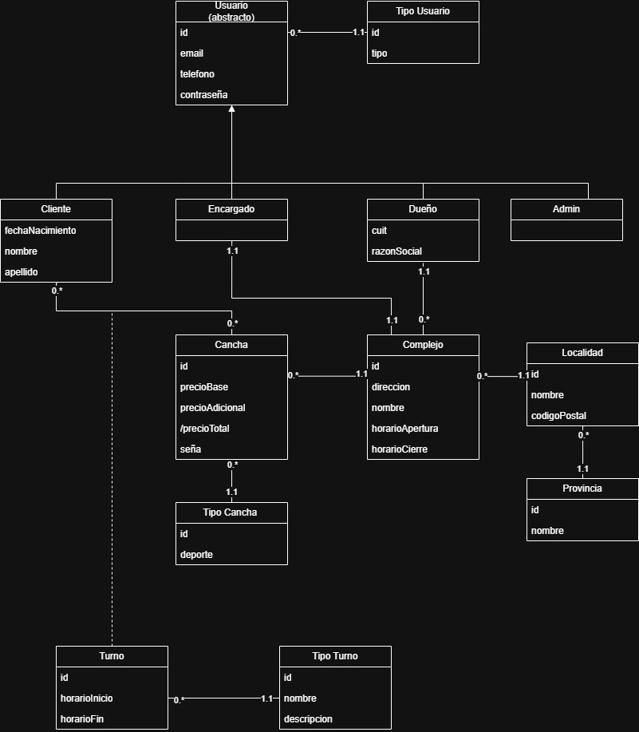

# Propuesta TP DSW

## Grupo
### Integrantes
* 53786, Ondategui, Mateo. 
* 54153, Lagostina, Lautaro Antolin
* 55027, Surjak, Mirko.

### Repositorios
* [frontend app](https://github.com/MateoSr/frontend)
* [backend app](https://github.com/MateoSr/backend)

## Tema
### Descripción
La propuesta de nuestro trabajo consiste en desarrollar un sistema que permita la gestión de alquileres de canchas de distintos deportes. Los Clientes podrán visualizar los turnos disponibles y realizar reservas sobre los mismos. Además, el Encargado podrá gestionar las canchas que tenga asignadas. Finalmente, el Dueño podrá acceder a distintas métricas relevantes para analizar el rendimiento de su negocio. 

### Modelo

  
   
  <em>Diagrama de Modelo de Dominio</em>

## Alcance Funcional 

### Alcance Mínimo

Regularidad:
|Req|Detalle|
|:-|:-|
|CRUD simple|1. CRUD Encargado de Cancha 2. CRUD Dueño de cancha  3. CRUD Tipo de Usuario|
|CRUD dependiente|1. CRUD Cancha {depende de} CRUD Complejo 2. CRUD Localidad {depende de} CRUD Provincia|
|Listado + detalle| 1. Listado de complejos que poseen turnos disponibles en un determinado horario para un deporte.  2. Listado de recaudación diario durante un mes por complejo|
|CUU/Epic|1. Reservar un turno de una cancha en un horario 2.Realizar reserva de turno fijo|

Adicionales para Aprobación
|Req|Detalle|
|:-|:-|
|CRUD |1. CRUD Encargado de Cancha 2. CRUD  Dueño de cancha 3. CRUD Tipo de Usuario 4. CRUD Localidad 5. CRUD Provincia 6. CRUD Cliente 7. CRUD Complejo   8.  CRUD Tipo de Cancha   9. CRUD Turno   10. CRUD Tipo de Turno|
|CUU/Epic|1. Reservar un turno de una cancha en un horario 2. Realizar reserva de turno fijo   3. Realizar una opinion del complejo|

### Alcance Adicional Voluntario

*Nota*: El Alcance Adicional Voluntario es opcional, pero ayuda a que la funcionalidad del sistema esté completa y será considerado en la nota en función de su complejidad y esfuerzo.

|Req|Detalle|
|:-|:-|
|Listados |Listado de turnos realizados por complejo + detalle   2. Listado de turnos de reservados diarios.|
|CUU/Epic|1. Cancelación de reserva|
|Otros|1. Envío de recordatorio de reserva por email previo al inicio del turno   2. Implementacion de billetera para realizar reserva|

